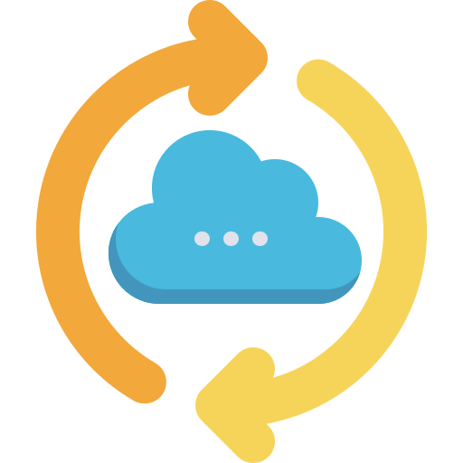

  

<h1 align="center">Nextclone</h1>

  A simple desktop app for backing up local folders to Nextcloud.

  English | <a href="README.de.md">Deutsch</a>

## What Nextclone Does

- Copies or syncs folders from your computer to Nextcloud.
- Lets you create multiple backup jobs.
- Can run jobs manually or on a schedule.
- Can start in the background when you sign in.
- Shows logs for each job.
- Includes rclone in the release downloads, so you usually do not need to install it separately.

## Installation

You do not need to download the source code or use GitHub tools. Use the prepared download for your operating system.

1. Open the [latest Nextclone release](https://github.com/marvinscham/nextclone/releases/latest).
2. Scroll to the "Assets" section.
3. Download the file for your operating system.

### Windows

1. Download `nextclone_v..._windows_amd64.zip`.
2. Open the downloaded zip file.
3. Extract it to a folder, for example your Desktop or Documents folder.
4. Double-click `nextclone-windows-amd64.exe` to start Nextclone.

If Windows shows a warning because the app is new or unsigned, choose "More info" and then "Run anyway" only if you downloaded it from the official Nextclone release page.

### Linux

For Debian, Ubuntu, Linux Mint, and similar distributions:

1. Download `nextclone_v..._linux_amd64.deb`.
2. Open the downloaded file with your software installer.
3. Click Install.
4. Start Nextclone from your app launcher.

If your Linux distribution does not support `.deb` files, download `nextclone_v..._linux_amd64.zip`, extract it, and run the `nextclone-linux-amd64` file.

## First Setup

Before creating a sync job, connect Nextclone to your Nextcloud account.

1. Open Nextclone.
2. Click "Remote Setup".
3. Enter your Nextcloud server address, for example `https://cloud.example.com`.
4. Enter your Nextcloud username.
5. Click "Create app password" if you need a Nextcloud app password.
6. Paste the app password into Nextclone.
7. Click "Create remote".

An app password is safer than using your normal Nextcloud password. You can remove it later from your Nextcloud security settings if needed.

## Creating A Backup Job

1. Click "Add Sync".
2. Choose a name for the job, for example "Documents backup".
3. Pick the local folder you want to upload.
4. Enter the remote name you created during setup, usually `nextcloud`.
5. Enter the Nextcloud destination folder, for example `/Backups/Documents`.
6. Choose the mode.
7. Save the job.
8. Click "Start" to run it.

### Copy Or Sync

- `copy` uploads new and changed files, but does not delete files from Nextcloud. This is the safer choice for most people.
- `sync` makes the Nextcloud folder match your local folder. Files deleted locally can also be deleted from Nextcloud.

Use `copy` unless you specifically want exact mirroring.

## Automatic Backups

When creating or editing a job, enable "Run automatically" and choose how often it should run.

To let scheduled backups run after you sign in, open "Settings" and enable "Start Nextclone in the background when I sign in".

## Updates

Nextclone checks for new versions when it starts. If an update is available, the update button in the top menu turns green. Click it to inst

## Development

Developer setup, build, scheduling, rclone, and release details are documented in [DEVELOPMENT.md](DEVELOPMENT.md).
## Icon credit

[Sync icons created by Freepik - Flaticon](https://www.flaticon.com/free-icons/sync)
